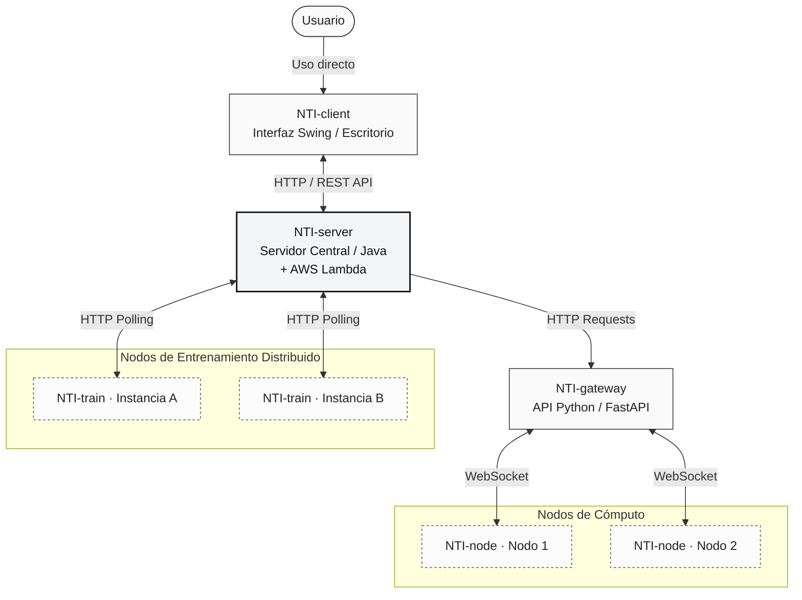

<p align="center">

</p>

<h2 align="center">NeuroFref Trading Intelligence</h2>

<p align="center">
  Sistema distribuido de entrenamiento y predicción bursátil basado en redes neuronales artificiales
</p>

<p align="center">
  
  
  
  
  
  
</p>

---

## Sobre el proyecto

N.T.I. fue desarrollado como Trabajo Práctico Integrador Anual (ciclo 2025) en el marco de una escuela técnica, integrando las materias Análisis de Sistemas, Laboratorio de POO y Administración y Gestión de Bases de Datos.

El objetivo fue construir un sistema completo que entrenara redes neuronales para predecir el precio de cierre de acciones del mercado bursátil, y expusiera esas predicciones a través de una interfaz de escritorio orientada al inversor. El foco estuvo en la arquitectura distribuida: múltiples dispositivos pueden entrenar modelos en paralelo coordinados por un servidor central, sin que dos máquinas procesen el mismo modelo simultáneamente. Además, el gateway puede delegar la ejecución de scripts de datos a Nodos conectados vía WebSocket, permitiendo escalar horizontalmente la carga de obtención de datos financieros.

Para la gestión y desarrollo del ciclo de vida del software se utilizó la metodología **RUP (Rational Unified Process)**, apoyada en tableros **Kanban** para la administración ágil de tareas y el seguimiento del progreso del equipo.

> [!CAUTION]
> Los modelos son una herramienta de análisis de referencia. No constituyen asesoramiento financiero. Los autores no se responsabilizan por decisiones de inversión tomadas en base a la información que muestra el sistema.

---

## Repositorios

| Repo | Tecnología | Descripción |
|---|---|---|
| [NTI-client](https://github.com/FrefLabs/NTI-client) | Java 8 · Swing · JFreeChart | Interfaz de escritorio para el usuario |
| [NTI-server](https://github.com/FrefLabs/NTI-server) | Java 8 · AWS Lambda | Servidor REST central + funciones Lambda, gestión de la cola de entrenamientos |
| [NTI-train](https://github.com/FrefLabs/NTI-train) | Java 8 · Neuroph | Cliente de entrenamiento distribuido (M1 y M2) |
| [NTI-gateway](https://github.com/FrefLabs/NTI-gateway) | Python · FastAPI | Gateway de scripts financieros con soporte de Nodos WebSocket |
| [NTI-node](https://github.com/FrefLabs/NTI-node) | Python · WebSockets | Nodo de cómputo que ejecuta scripts delegados por el gateway |

---

## Arquitectura

El sistema está compuesto por cinco módulos independientes organizados en una arquitectura distribuida por capas, comunicados exclusivamente a través de interfaces de red:



El cliente solo habla con el servidor. El servidor coordina el gateway (para datos financieros) y los dispositivos de entrenamiento (NTI-train), los cuales no se conocen entre sí. El gateway puede delegar la ejecución de scripts pesados a Nodos (NTI-node) conectados vía WebSocket, con balanceo de carga round-robin y reintento automático en caso de rate limit.

---

## Flujo completo

### 1. Crear un modelo (NTI-client → NTI-server)

Desde la pantalla de Modelos, el usuario define los parámetros de entrenamiento y envía la solicitud al servidor. El servidor registra el modelo con estado `Por hacer` en la cola.

Parámetros configurables:

| Parámetro | Descripción | Ejemplo |
| --- | --- | --- |
| Ticker | Símbolo de la acción | `KO`, `AAPL`, `TSLA` |
| Fecha inicio / fin | Rango del dataset histórico | `15/03/1962 - 02/10/2025` |
| Arquitectura | Capas ocultas del MLP | `32,16` → dos capas |
| Funciones | Función de activación por capa | `SIGMOID,SIGMOID` |
| Learning Rate | Velocidad de aprendizaje | `0.001` |
| Max Error | Error objetivo para detener | `0.005` |
| Max Iterations | Límite de épocas | `5000` |

### 2. Obtener datos (NTI-server → NTI-gateway → NTI-node)

Cuando un dispositivo de entrenamiento reclama un modelo, el servidor le solicita al gateway los datos históricos del ticker. El gateway ejecuta scripts Python contra Yahoo Finance, normaliza el dataset y devuelve los archivos necesarios.

Si Yahoo Finance devuelve un error 429 (rate limit), el gateway redistribuye la tarea a un Nodo (NTI-node) disponible vía WebSocket en lugar de fallar. El balanceador round-robin prioriza Nodos libres y reintenta hasta 3 veces con Nodos distintos.

### 3. Entrenar (NTI-train)

NTI-train es un proceso que corre en segundo plano en cualquier PC disponible. Cada 30 segundos pregunta al servidor si hay trabajo. Cuando recibe un modelo:

1. Ejecuta el pipeline de datos (scripts Python compilados a binario)
2. Construye el MLP con la arquitectura configurada
3. Entrena con Backpropagation en modo batch
4. Evalúa con el 30% del dataset reservado para test
5. Envía al servidor el modelo `.nnet`, las métricas y los parámetros de normalización

**Red de refinamiento M2:** Además del modelo base (M1), el sistema soporta una segunda red (M2) que combina las predicciones de M1 con datos fundamentales financieros (ratios PE, EV/EBITDA, etc.) para refinar la predicción.

Varios dispositivos pueden correr en paralelo. El servidor usa bloqueo atómico sobre el CSV para garantizar que cada modelo sea asignado a exactamente un dispositivo.

### 4. Consultar resultados (NTI-client)

Una vez finalizado el entrenamiento, el modelo aparece en la interfaz con su precisión, métricas detalladas, historial de predicciones y los parámetros usados. El cliente consume exclusivamente la API REST de NTI-server; no hay conexiones directas a base de datos ni dependencia de APIs de terceros desde el cliente.

---

## Red neuronal

### M1 — Modelo base

**Tipo:** Perceptrón Multicapa (MLP) — biblioteca Neuroph 2.98

**Entradas:** 19 features técnicos por fila del dataset:

```
FECHA, OPEN_HOY, HIGH_AYER, LOW_AYER, CLOSE_AYER, VOLUME_AYER,
GAP_APERTURA, RANGO_AYER, CLOSE_POSITION_AYER, VOLUMEN_RATIO,
ATR_14, RSI_14, SMA_5, SMA_20, SMA_50, EMA_12, EMA_26,
DIA_SEMANA, CLOSE_HOY
```

**Salida:** 1 neurona con activación lineal → precio de cierre predicho (desnormalizado)

**Capa de salida:** siempre lineal (regresión de valor continuo)

**Capas ocultas:** configurables. Funciones de activación disponibles: `SIGMOID`, `TANH`, `LINEAR`, `RAMP`, `STEP`

**Entrenamiento:**
* Algoritmo: Backpropagation batch
* Split: 70% entrenamiento / 30% test
* Normalización: min-max por columna
* Detención automática si el error no mejora en 20 iteraciones consecutivas (convergencia)

### M2 — Red de refinamiento

**Tipo:** MLP que toma como entrada las predicciones de M1 + datos fundamentales financieros

**Pipeline M2:**
1. `generate_fundamentals_dataset.py` — obtiene ratios financieros (PE, EV/EBITDA, etc.)
2. `generate_dataset_m2.py` — combina predicciones M1 + fundamentales + cierre real
3. `normalize_dataset_m2.py` — normaliza usando los mismos parámetros de M1 para consistencia
4. Entrenamiento y evaluación específicos de M2

---

## Métricas

Calculadas sobre el test set con valores desnormalizados a dólares reales:

| Métrica | Descripción |
| --- | --- |
| MSE | Error cuadrático medio |
| RMSE | Raíz del MSE |
| MAE | Error absoluto medio (en dólares) |
| MAPE | Error porcentual medio absoluto |
| R² | Coeficiente de determinación |
| Precisión | `(100 - MAPE) / 100` |
| Percentil 90 | Error por debajo del cual cae el 90% de las predicciones |

---

## Interfaz - NTI-client

[Ver diseño original en Figma](https://www.figma.com/proto/rUYBdFCAUVYy6oHoE4gklI/NTI?node-id=1-4&p=f&t=HaNuYnw0eofhINh9-1&scaling=scale-down&content-scaling=fixed&page-id=0%3A1)

### Pantalla de Inicio

Dashboard principal. Gráfico de línea/customizable (JFreeChart) con selector de estilo de gráfica (Línea / Línea y Puntos / Solo Puntos) y datos de los últimos 7 días. Panel de datos de la empresa seleccionada. Precio actual del ticker con actualización automática, recomendación diaria (COMPRAR / MANTENER / VENDER), precio de cierre predicho por el modelo activo, y feed de noticias recientes.

### Pantalla de Modelos

Lista de modelos disponibles con buscador en tiempo real. Muestra el modelo actualmente seleccionado con su precisión, error promedio y rango de entrenamiento. Botón para crear un nuevo modelo con todos los parámetros configurables.

### Detalle de modelo

Al hacer clic en un modelo se accede a la vista detalle: features usadas en el entrenamiento, métricas sobre el período de entrenamiento (MSE, RMSE, MAE, R², max/min error, percentil 90, precisión), métricas post-entrenamiento, e hiperparámetros usados.

### Historial

Predicciones día a día del modelo activo: fecha, apertura, máximo, mínimo, cierre real, cierre predicho y diferencia en dólares.

### Ajustes

Configuración de moneda (lista dinámica obtenida del servidor), red de refinamiento, efectos de sonido (SFX), y volumen de música con slider.

### Juego

Modo de juego educativo "Tira y Afloje" donde el jugador predice si el precio de una acción subirá o bajará, usando datos reales del mercado. Incluye sistema de puntos, rondas, rankings y efectos de sonido.

---

## Tecnologías

**NTI-client:** Java 8 · Swing · CardLayout · JFreeChart 1.0.19 · Apache Ant

**NTI-server:** Java 8 · HTTP Server embebido · AWS Lambda · MariaDB · OpenCSV

**NTI-train:** Java 8 · Neuroph 2.98 · Apache Ant

**NTI-gateway:** Python 3.9+ · FastAPI 0.104 · Uvicorn · WebSockets · yfinance · pandas · numpy · scikit-learn

**NTI-node:** Python 3.9+ · WebSockets · PyYAML

**APIs externas:** Yahoo Finance (datos históricos, vía gateway) · Finnhub (noticias, vía server)

---

## Estado

> [!NOTE]
> **Proyecto Finalizado**
> Este sistema fue desarrollado como entrega final para el ciclo lectivo 2025. El código se mantiene publicado a modo de demostración técnica y registro del trabajo realizado. Se planea una reescritura en el futuro dado que la arquitectura actual tiene limitaciones conocidas, por lo que no se están aceptando *PRs* de mantenimiento activo y no hay demo pública.

---

## Equipo

Proyecto desarrollado conjuntamente por:

* Luca Guarna
* Nicolás Pereira
* Federico Battistello
* Franco Perfetti
* Juan Sirota
